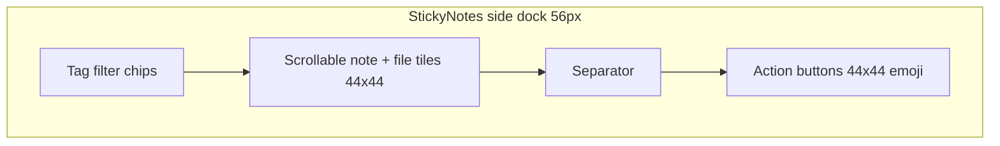

# Dock Visual & Size Review

A comparative design review of StickyNotes dock dimensions and visual treatment against common dock/sidebar apps, with prioritized recommendations.

## Implementation todos

- [ ] Remove file labels from 44x44 rail tiles; rely on tooltip + hover popup
- [ ] Add `#tagChip` stylesheet in `theme.py` matching dark-rail design tokens
- [ ] Prototype THICK 52-48px with margin adjustments; verify 44px tiles still fit
- [ ] Reduce separator density and consider bottom-pinned action layout

## Your dock today

From [`stickynotes/ui/dock.py`](../../stickynotes/ui/dock.py) and [`stickynotes/theme.py`](../../stickynotes/theme.py):

| Element | Current value |
|---------|---------------|
| Dock thickness (`THICK`) | **56px** (shown width for side dock) |
| Hidden peek strip (`TRIGGER`) | **4px** |
| Outer padding / spacing | **4px** margins, **4px** gaps |
| Note / file / action tiles | **44×44px** |
| Action button wrapper | **48px** wide |
| Action glyph size | **20px** emoji |
| File icon (indicator) | **28px** pixmap + truncated label below |
| Border radius (dock chrome) | **11px** |
| Border radius (tiles) | **8px** |
| Background | Semi-transparent dark (`rgba(37–39, 0.82–0.88)`) |

The side dock in practice: a blue **"All"** tag chip at top, file shortcuts with icon + clipped labels ("Word", "engine…"), colour-coded note tiles, and a long stack of emoji action buttons at the bottom separated by hairlines.



---

## How other dock-style apps compare

### Icon-only rails (closest peers)

| App | Rail width | Icon / row height | Icon size | Labels | Notes |
|-----|-----------|-------------------|-----------|--------|-------|
| **VS Code Activity Bar** (default) | **48px** | **48px** rows | **24px** | Tooltip only | Left accent bar for active item; monochrome vector icons |
| **VS Code Activity Bar** (compact) | **36px** | **32px** rows | **16px** | Tooltip only | User-toggleable |
| **Obsidian ribbon** | **44px** (`--ribbon-width`) | ~icon height | ~18–22px | Tooltip only | Collapsible; icons only in rail |
| **Material 3 Navigation Rail** | **80dp** | **56dp** rows | **24dp** | Label below icon | Wider because it always shows text |
| **UX collapsed-sidebar norm** | **48–64px** | **40–48px** min target | **22–24px** | Tooltip or hover label | Apple/WCAG min touch target: **44×44px** |

### Content panels (different paradigm — not icon rails)

| App | Typical width | Role |
|-----|--------------|------|
| **OneNote dock-to-desktop** | **~250–350px** (user-resizable) | Full note editor panel, not an icon strip |
| **Slack / Teams sidebar** (expanded) | **240–300px** | Conversation list with text |
| **macOS Dock** | Height ~64px default (user slider) | Horizontal launcher with magnification |

**Takeaway:** StickyNotes is correctly in the **icon-rail** category, not the OneNote **content-panel** category. At **56px** it sits at the **upper end** of the collapsed-rail range (48–64px) — slightly wider than VS Code (48px) and Obsidian (44px), but still within industry norms and aligned with your DESIGN.md **44px touch-target** rule.

---

## Visual comparison — what peers do differently

### 1. Icons vs labels in the rail
- **Peers:** Icon-only in the rail; full names appear in tooltips, popups, or a wider panel.
- **StickyNotes:** File shortcuts stack a **28px icon + micro label** inside a **44×44** tile (`DockFileIndicator` in `dock.py`). This is the main visual outlier — labels clip awkwardly ("engine…") and compete with the icon for space.
- **Your note tiles** (colour fill + emoji/text preview) are appropriate for this product and have no direct peer equivalent.

### 2. Active / selected state
- **VS Code:** 2px left border accent + background tint.
- **Obsidian:** Subtle background highlight on hover/active.
- **Material 3:** Full-width tonal block behind active item.
- **StickyNotes:** Note tiles use colour borders; file tiles use translucent white border; tag filter uses `QPushButton` checked state with **no `#tagChip` stylesheet** in `theme.py` — the blue "All" button is default Qt styling, not the design system.

### 3. Action button treatment
- **Peers:** Monochrome vector icons, consistent stroke weight, grouped by function with spacing (not separators between every item).
- **StickyNotes:** Emoji glyphs at 20px in 44×44 tiles, grouped with **2px hairline separators** between groups. Distinctive and on-brand for a notes app, but reads less "system-native" than VS Code/Obsidian.

### 4. Chrome and density
- **Peers:** Flat or near-flat backgrounds; minimal border radius on the rail itself (VS Code: square edge; Obsidian: subtle).
- **StickyNotes:** **11px rounded** dock chrome + **82–88% opacity** dark fill — closer to a floating macOS-style bar. This is a deliberate Apple-inspired choice from [`DESIGN.md`](../../DESIGN.md) and looks appropriate; it differentiates from dev-tool rails.

### 5. Vertical layout / empty space
- **Peers:** Rails are usually edge-to-edge with items top-aligned; secondary actions pinned to bottom (VS Code settings/accounts at bottom of activity bar).
- **StickyNotes:** Tag row → scrollable middle → separator → bottom actions. The large empty gap when few notes are pinned is expected — the scroll area expands. Peers solve this by not having a scroll region between fixed top/bottom zones, or by using a fixed item height list.

---

## Assessment summary

| Dimension | Verdict |
|-----------|---------|
| **Overall width (56px)** | Acceptable — within 48–64px norm; **8px wider** than VS Code/Obsidian |
| **Tile size (44×44)** | Correct — matches DESIGN.md touch target and Apple `button-icon-circular` |
| **File shortcut labels in rail** | **Misaligned with peers** — main visual/density problem |
| **Tag filter chip styling** | **Missing** — unstyled button breaks the dark-rail aesthetic |
| **Action button stack** | Functional but tall (7 items + 4 separators); denser than most rails |
| **Colour-coded note tiles** | Strong differentiator; appropriate for the product |
| **Semi-transparent rounded chrome** | Polished; distinct from flat dev-tool rails |

---

## Prioritized recommendations (for when you implement)

### High impact, low risk
1. **Remove file labels from the 44×44 rail tile** — show icon only (or badge fallback); keep full name in tooltip + existing `DockFilePopup` on hover. Matches Obsidian/VS Code pattern and fixes clipped text.
2. **Add `#tagChip` stylesheet** in `theme.py` — small pill/chip on dark surface (similar to `button-pearl-capsule` / `configurator-option-chip` tokens in DESIGN.md), not a full-width primary blue button.
3. **Reduce file icon to 24px** inside the 44×44 tile once labels are removed — aligns with the 22–24px peer norm and gives more breathing room.

### Medium impact — sizing
4. **Consider narrowing `THICK` from 56 → 48px** — matches VS Code default; with 4px outer margins + 44px tile you'd need to either drop outer margins to 2px or shrink tiles to 40×40 (still above WCAG 24px minimum, but below Apple 44px recommendation). **Safest path: keep 44px tiles, reduce outer margins to 2px, set `THICK = 52`** as a compromise, or **keep 56px** and accept slightly wider rail.
5. **Optional compact mode** (like VS Code): 48px default / 40px compact with 36×36 tiles and 16px glyphs — only worth it if users request less screen real estate.

### Lower priority — polish
6. **Soften separator density** in the action stack — one separator before the bottom group instead of between every group.
7. **Pin action toolbar to bottom** with a max-height scroll only for note/file tiles (reduces the "floating in empty space" feel when note count is low).
8. **Active-state accent** on the selected tag chip and hovered file tile (2px left border or tonal block, per Material 3 / VS Code).

### Not recommended (for this app)
- **Resizable dock like OneNote** — your dock is a launcher/rail, not a content panel; resizable width adds complexity without matching user mental model.
- **Shrinking below 40px rail width** — would break 44px touch targets and file/note readability.

---

## Reference constants to keep in code if you implement later

Centralize in `dock.py` (currently scattered):

```
THICK = 56          # rail width/height
TILE = 44           # indicator + action button
FILE_ICON = 28      # → recommend 24 after label removal
GLYPH = 20          # action emoji size
OUTER_PAD = 4       # → could reduce to 2 if narrowing
```

Any `THICK` change must update geometry tests in `tests/test_dock.py` and `tests/test_app_manager_dock.py`.

---

## Suggested next step

When ready to implement, the highest-value single change is **icon-only file shortcuts + styled tag chips** — that alone will make the dock feel much closer to Obsidian/VS Code without changing overall width.
